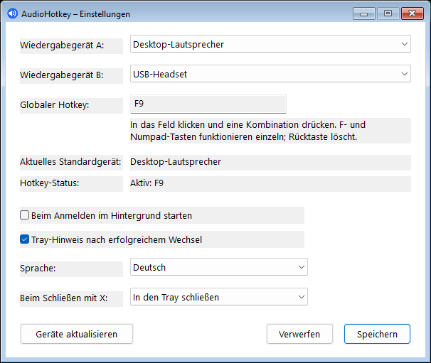
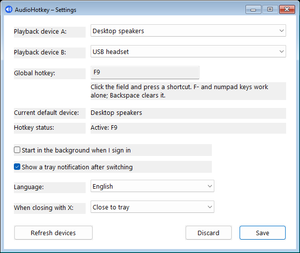

# AudioHotkey

AudioHotkey ist eine portable, native Windows-11-Anwendung zum schnellen Umschalten des systemweiten Standard-Wiedergabegeräts. Sie läuft ressourcenschonend im Infobereich, reagiert ereignisbasiert und benötigt weder Installation noch Administratorrechte oder zusätzliche Laufzeitumgebungen.

[Release v1.0 herunterladen](https://github.com/philipphoh/AudioHotkey/releases/latest)

## Oberfläche

| Deutsch | English |
| --- | --- |
|  |  |

Die Sprache lässt sich unmittelbar im Einstellungsfenster wechseln. Fenster, Tray-Menü, Statusanzeigen, Hinweise und Fehlermeldungen werden gemeinsam umgestellt.

## Funktionen

- Umschalten zwischen zwei frei wählbaren Wiedergabegeräten
- gemeinsames Setzen der Windows-Rollen **System**, **Multimedia** und **Kommunikation**
- globaler Hotkey über die offizielle Windows-Hotkey-API, ohne Tastatur-Polling
- F1–F11 und F13–F24 können ohne Modifikatortaste verwendet werden
- Ziffernblock 0–9 sowie Multiplikation, Addition, Trennzeichen, Subtraktion, Dezimalzeichen und Division funktionieren ebenfalls einzeln
- normale Tasten erfordern mindestens Strg, Alt oder Umschalt
- verständlicher Hinweis bei ungültiger oder bereits anderweitig registrierter Tastenkombination
- deutsch- und englischsprachige Oberfläche
- Tray-Hinweis nach erfolgreichem Wechsel, optional abschaltbar
- Autostart im Benutzerkontext mit verborgenem Fenster
- genau eine Instanz pro Benutzer; ein weiterer Start öffnet die vorhandene Oberfläche
- automatische Reaktion auf Audioänderungen und einen Neustart des Windows Explorers
- keine Netzwerkzugriffe, Telemetrie, Protokolldateien oder Helferprozesse

## Installation und Verwendung

1. `AudioHotkey.exe` aus dem aktuellen [GitHub Release](https://github.com/philipphoh/AudioHotkey/releases/latest) herunterladen.
2. Die EXE in einen dauerhaft verfügbaren Ordner verschieben.
3. AudioHotkey starten und Wiedergabegerät A sowie B auswählen.
4. In das Hotkey-Feld klicken und die gewünschte Tastenkombination drücken.
5. Einstellungen speichern.

Ein Linksklick auf das Tray-Icon öffnet das Fenster. Das Kontextmenü bietet **Einstellungen**, den erforderlichen **Icon-Nachweis** und **Beenden**. Die Schließen-Schaltfläche kann wahlweise nur das Fenster verbergen oder das Programm vollständig beenden.

Mit Rücktaste, Entfernen oder Escape wird das Hotkey-Feld geleert. F12 ist systemweit für Debugger reserviert und wird deshalb nicht akzeptiert.

### Kommandozeile

```text
AudioHotkey.exe
AudioHotkey.exe --background
```

Ohne Argument startet eine neue sichtbare Instanz oder öffnet die bereits laufende Oberfläche. `--background` startet eine neue Instanz ausschließlich im Tray; dieser Modus wird auch für den optionalen Autostart verwendet.

## Einstellungen

Die Konfiguration wird atomar unter folgendem Pfad gespeichert:

```text
%LOCALAPPDATA%\AudioHotkey\settings.ini
```

Gespeichert werden die stabilen Windows-Endpoint-IDs und Anzeigenamen beider Geräte, der Hotkey, die Sprache, Autostart, Tray-Hinweise und das Verhalten der Schließen-Schaltfläche. Nach einer Treiber-Neuinstallation kann Windows einem Gerät eine neue Endpoint-ID zuweisen; in diesem Fall muss es erneut ausgewählt werden.

Der Autostart verwendet den benutzerbezogenen Registry-Eintrag `HKCU\Software\Microsoft\Windows\CurrentVersion\Run`. Es sind keine Administratorrechte erforderlich.

## Technischer Aufbau

AudioHotkey ist vollständig in C++20 mit Win32 und dem Windows SDK implementiert. Der Release-Build verwendet die statische C++-Laufzeit (`/MT`) und erzeugt eine einzelne x64-EXE.

| Datei | Verantwortung |
| --- | --- |
| `src/main.cpp` | Prozesseinstieg, COM-Initialisierung, Argumentauswertung und Einzelinstanz-Mechanismus |
| `src/App.cpp` / `App.h` | Win32-Fenster, Tray-Icon, globale Hotkeys, Autostart und Anwendungssteuerung |
| `src/AudioEndpoint.cpp` / `AudioEndpoint.h` | Core-Audio-Geräte, Benachrichtigungen, Standardgerätwechsel, Verifikation und Rücksetzung |
| `src/Settings.cpp` / `Settings.h` | Laden und atomisches Speichern der INI-Konfiguration |
| `src/CoreLogic.cpp` / `CoreLogic.h` | Hotkey-Validierung und geräteunabhängige Umschaltlogik |
| `src/Localization.cpp` / `Localization.h` | deutsche und englische Oberflächentexte |
| `src/AudioHotkey.rc` | Versionsinformationen, UTF-8-Ressourcen, Manifest und Programmsymbol |

### Audio-Umschaltung

Aktive Wiedergabegeräte werden über `IMMDeviceEnumerator` ermittelt. Änderungen an Geräten und Standard-Endpunkten meldet ein `IMMNotificationClient` ereignisbasiert an den UI-Thread.

Microsoft stellt Desktop-Anwendungen keinen dokumentierten Win32-Setter für das Standard-Audiogerät bereit. Das Setzen ist deshalb in einem kleinen Adapter über die interne `PolicyConfig`-COM-Schnittstelle gekapselt. Vor dem Wechsel werden die bisherigen Endpunkte aller drei Rollen gespeichert. Jede Änderung wird anschließend über `IMMDeviceEnumerator::GetDefaultAudioEndpoint` verifiziert; bei einem Teilfehler erfolgt eine bestmögliche Rücksetzung.

Ist Gerät A aktuell Standard, wird zu B gewechselt, andernfalls zu A. Ein getrenntes oder deaktiviertes Ziel verändert das aktuelle Standardgerät nicht.

### Ereignismodell

Im Leerlauf findet kein Polling statt. Arbeit entsteht ausschließlich durch Windows-Nachrichten für Hotkeys, Tray- und Fensteraktionen sowie Audio- und Explorer-Ereignisse. Ein benannter Mutex begrenzt AudioHotkey auf eine Instanz pro angemeldetem Benutzer.

## Selbst bauen

Benötigt werden:

- Windows 11 x64
- Visual Studio 2022 Build Tools
- Workload **Desktopentwicklung mit C++**
- aktuelles Windows SDK

In einer Developer PowerShell:

```powershell
msbuild AudioHotkey.sln /m /p:Configuration=Release /p:Platform=x64
```

Das Ergebnis liegt unter `build\Release\AudioHotkey.exe`.

## Gemessene Release-Werte

Gemessen auf Windows 11 x64 nach fünf Sekunden Aufwärmphase und anschließend zehn Sekunden ohne Eingabe:

| Prüfung | Ergebnis |
| --- | ---: |
| EXE-Größe | 253.952 Bytes |
| Working Set | 15,04 MB |
| privater Speicher | 2,06 MB |
| Leerlauf-CPU | 0 % |

Die Werte können abhängig von Windows-Version, Audiotreibern und geladenen Systembibliotheken leicht abweichen.

## Sicherheit und Datenschutz

AudioHotkey arbeitet ausschließlich im Kontext des angemeldeten Benutzers. Die Anwendung benötigt keine erhöhten Rechte und führt keine Netzwerkzugriffe durch. Sämtliche Einstellungen verbleiben lokal auf dem Rechner.

## Lizenz und Bildnachweis

Der Quellcode steht unter der [MIT-Lizenz](LICENSE).

Das Lautsprecher-Motiv wurde von [Bharat Icons auf Flaticon](https://www.flaticon.com/de/kostenloses-icon/lautstarke-erhohen_6996058) erstellt und unter der kostenlosen Flaticon-Lizenz mit erforderlichem Bildnachweis verwendet. Einzelheiten stehen in [THIRD_PARTY_NOTICES.md](THIRD_PARTY_NOTICES.md).
